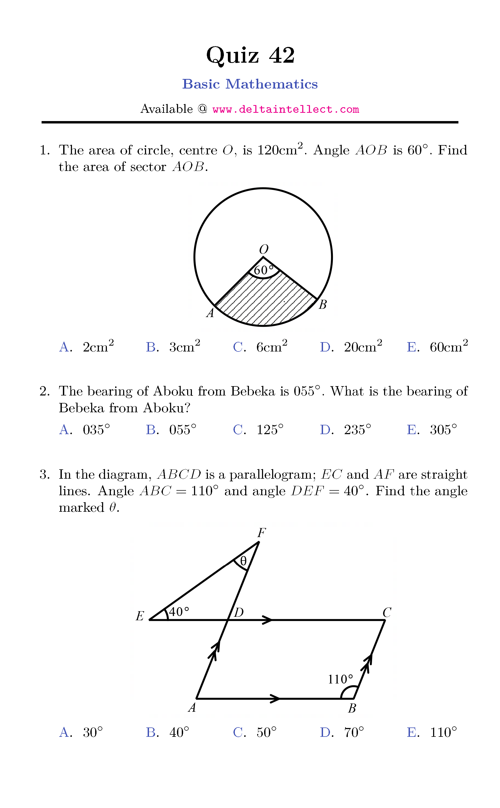

Need to improve your basic math skills? We've got you covered with over 200 sets of quizzes covering a wide range of basic math topics. Our quizzes spans multiple choice questions (MCQ) and essay type of questions for daily practice. Each multiple choice quiz has a minimum of 2 questions and a maximum of 8 questions.

A sample of MCQ is shown below.

Please click on your preferred quiz number to download it.



{}
Please check back for the updated contents.
{}

Good Luck!
